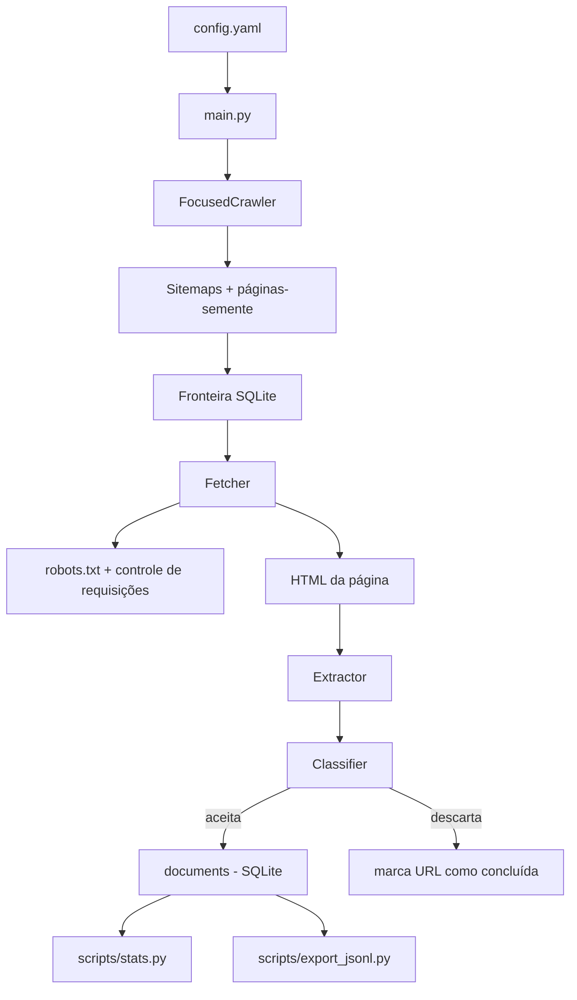

# RI Futebol Brasileiro ⚽

Projeto acadêmico de **Recuperação da Informação (RI)** desenvolvido em Python para coletar notícias recentes sobre **futebol brasileiro** em diferentes portais esportivos.

Esta é a **Etapa 1 — Coletor** do trabalho. A coleção criada aqui será usada depois nas etapas de **representação/indexação** e **recuperação/busca**.

O objetivo do coletor é encontrar páginas de notícias, filtrar o que realmente pertence ao tema, extrair o texto principal e salvar os documentos de forma persistente para que a coleta possa continuar mesmo depois de o programa ser interrompido.

---

## 1. Proposta do sistema de RI

A proposta do projeto é construir, ao final das três etapas, um mecanismo de busca voltado para **notícias de futebol brasileiro**.

A ideia é permitir consultas como:

- notícias sobre Flamengo, Cruzeiro, Corinthians, Palmeiras, Atlético-MG etc.;
- notícias sobre Brasileirão, Copa do Brasil e Libertadores;
- notícias sobre a Seleção Brasileira;
- mercado da bola e transferências;
- busca textual livre por assunto, jogador, clube ou competição.

Nesta primeira etapa ainda **não existe o mecanismo de busca**. O foco é montar a coleção de documentos que será indexada posteriormente.

---

## 2. O que o coletor faz

O projeto implementa um **crawler focado, multissite e incremental**.

Em termos simples, o programa faz o seguinte:

1. carrega as configurações do projeto;
2. começa por páginas esportivas definidas em `config.yaml`;
3. consulta `robots.txt` e sitemaps dos sites;
4. descobre URLs que parecem relacionadas a futebol brasileiro;
5. coloca essas URLs em uma fila persistente;
6. acessa as páginas respeitando um intervalo entre requisições;
7. extrai título, data, autor e texto principal;
8. verifica se a página realmente é uma notícia recente sobre futebol brasileiro;
9. elimina duplicatas;
10. salva a notícia no banco SQLite;
11. continua até atingir o número-alvo de documentos ou não existirem mais URLs disponíveis.

---

## 3. Fontes usadas

Atualmente o projeto possui sementes para portais esportivos como:

- UOL Esporte;
- Terra;
- CNN Brasil Esportes;
- ESPN Brasil;
- ge;
- Lance!.

As URLs iniciais e os domínios permitidos ficam em `config.yaml`.

O crawler **não navega pela internet inteira**. Ele permanece restrito aos domínios explicitamente configurados.

---

## 4. Visão geral da arquitetura



O banco SQLite funciona tanto como **armazenamento da coleção** quanto como **checkpoint da coleta**.

Isso significa que, se o programa for fechado depois de coletar 10 mil documentos, por exemplo, ao executar novamente ele pode continuar usando o mesmo banco em vez de começar do zero.

---

# 5. Estrutura do projeto

```text
ri-futebol-brasileiro/
├── main.py
├── config.yaml
├── requirements.txt
├── README.md
├── LICENSE
│
├── src/
│   ├── classifier.py
│   ├── config.py
│   ├── crawler.py
│   ├── extractor.py
│   ├── fetcher.py
│   ├── models.py
│   ├── robots.py
│   ├── sitemaps.py
│   ├── storage.py
│   └── url_utils.py
│
├── scripts/
│   ├── stats.py
│   └── export_jsonl.py
│
├── tests/
│   ├── test_classifier.py
│   ├── test_extractor.py
│   ├── test_storage.py
│   └── test_url_utils.py
│
├── docs/
│   └── decisoes_tecnicas.md
│
└── data/
```

---

# 6. O que cada parte do código faz

## `main.py`

É o ponto de entrada da aplicação.

Ele:

- lê os argumentos do terminal;
- carrega `config.yaml`;
- permite sobrescrever quantidade de documentos, quantidade de dias e concorrência;
- inicia o `FocusedCrawler`.

Exemplo:

```bash
python main.py --target 100 --days 30
```

Nesse caso, o programa tenta armazenar pelo menos 100 documentos publicados nos últimos 30 dias.

---

## `src/crawler.py`

É o coordenador principal da coleta.

Ele controla:

- páginas-semente;
- descoberta por sitemap;
- fronteira de URLs;
- processamento em lotes;
- filtro por data;
- filtro temático;
- armazenamento dos documentos;
- critério de parada.

O crawler trabalha de forma assíncrona usando `asyncio` e `aiohttp`, permitindo processar várias páginas sem precisar fazer tudo de forma estritamente sequencial.

---

## `src/sitemaps.py`

Responsável pela descoberta em escala.

Ele procura os sitemaps informados pelos sites em seus arquivos `robots.txt` e analisa as URLs encontradas.

Uma URL só entra na fronteira quando:

- pertence a um domínio autorizado;
- parece estar relacionada ao tema;
- não é um tipo de arquivo bloqueado;
- possui data de sitemap compatível com a janela definida, quando essa informação existe.

O uso de sitemap é importante porque permite encontrar milhares de páginas sem depender apenas dos links visíveis em uma única página inicial.

---

## `src/fetcher.py`

Responsável por baixar o HTML.

Possui:

- timeout por requisição;
- novas tentativas em falhas temporárias;
- backoff entre tentativas;
- validação de conteúdo HTML;
- redirecionamentos;
- integração com as regras de `robots.txt`.

---

## `src/robots.py`

Cuida da política de acesso aos sites.

O projeto consulta o `robots.txt` e também mantém um intervalo mínimo entre requisições realizadas ao mesmo domínio.

Na configuração atual existe um atraso mínimo de:

```yaml
per_domain_delay_seconds: 1.0
```

Isso evita realizar várias requisições seguidas ao mesmo servidor de maneira agressiva.

---

## `src/extractor.py`

Recebe o HTML e transforma a página em um documento útil para RI.

São extraídos, quando disponíveis:

- título;
- URL original;
- URL canônica;
- autor;
- descrição;
- data de publicação;
- texto principal;
- links encontrados na página.

O texto principal é extraído usando **Trafilatura**, reduzindo elementos como menus, barras laterais e rodapés.

Também é calculado um hash SHA-256 do conteúdo para ajudar na deduplicação.

---

## `src/classifier.py`

É o filtro temático do projeto.

O objetivo dele é responder aproximadamente à pergunta:

> Esta página realmente parece ser uma notícia sobre futebol brasileiro?

O código procura sinais como:

- termos de futebol;
- Brasileirão;
- Copa do Brasil;
- Libertadores;
- CBF;
- Seleção Brasileira;
- nomes de clubes brasileiros;
- termos presentes na URL.

Também existem sinais negativos para evitar páginas de outras modalidades, como:

- NBA;
- basquete;
- vôlei;
- tênis;
- Fórmula 1;
- MMA;
- NFL.

O título possui peso maior que o corpo da página porque menus de portais esportivos podem conter links de várias modalidades diferentes.

---

## `src/storage.py`

Controla o banco SQLite `data/coleta.db`.

O banco possui três grupos principais de informação:

### `frontier`

Fila das URLs encontradas pelo crawler.

Cada URL pode estar como:

- `pending` — esperando processamento;
- `processing` — sendo processada;
- `done` — processamento concluído;
- `failed` — ocorreu uma falha.

### `documents`

Notícias que passaram por todos os filtros e foram aceitas para a coleção.

### `errors`

Registra falhas encontradas durante a execução.

Essa persistência é o que permite interromper e continuar a coleta.

---

## `src/url_utils.py`

Normaliza e filtra URLs.

Entre outras coisas, remove parâmetros de rastreamento como:

```text
utm_source
utm_medium
utm_campaign
fbclid
gclid
```

Também bloqueia arquivos e páginas que não interessam ao projeto, como imagens, PDFs, vídeos, login, newsletter e galerias.

---

## `scripts/stats.py`

Mostra o estado atual da coleta.

```bash
python scripts/stats.py
```

A saída mostra informações como:

```text
Documentos válidos: 117
URLs pendentes: 11710
URLs com falha: 0

Por domínio:
...

Datas:
  Mais antiga: ...
  Mais recente: ...
```

Os números acima são apenas um exemplo de uma execução de teste. A coleta real muda conforme os sites e a data em que o programa é executado.

---

## `scripts/export_jsonl.py`

Exporta a coleção do SQLite para JSONL:

```bash
python scripts/export_jsonl.py
```

Resultado:

```text
data/noticias.jsonl
```

Esse arquivo será útil principalmente na próxima etapa, quando os documentos começarem a ser representados e indexados.

---

# 7. Principais decisões de projeto

## 7.1 Crawler focado

Não queremos simplesmente armazenar qualquer página esportiva.

O crawler dá prioridade a páginas relacionadas ao futebol brasileiro e só salva documentos aprovados pelo classificador temático.

**Motivo:** melhorar a qualidade da coleção e reduzir ruído para a futura etapa de recuperação.

---

## 7.2 Coleta multissite

Foram configurados vários portais em vez de apenas um.

**Motivo:** aumentar a cobertura do assunto e diminuir a dependência de uma única fonte.

A quantidade final por domínio não precisa ser igual. Ela depende da quantidade de URLs encontradas, estrutura de sitemap, disponibilidade e páginas aprovadas pelos filtros.

---

## 7.3 Descoberta por sitemap + links

O crawler combina duas formas de descoberta:

- sitemaps;
- links encontrados nas páginas HTML.

**Motivo:** os sitemaps oferecem escala, enquanto a navegação por links permite descobrir conteúdo relacionado que talvez não apareça imediatamente nos sitemaps analisados.

---

## 7.4 Coleta incremental

A fronteira e os documentos ficam no SQLite.

**Motivo:** uma coleta de dezenas de milhares de páginas pode levar bastante tempo e não deve depender de uma única execução contínua.

Se o programa for interrompido, itens que estavam marcados como `processing` são recolocados como pendentes quando o banco é aberto novamente.

---

## 7.5 Recência

A configuração padrão usa:

```yaml
max_age_days: 365
```

Ou seja, inicialmente o projeto trabalha com notícias de até um ano.

Páginas antigas demais são descartadas.

**Motivo:** manter a coleção relacionada ao cenário recente do futebol brasileiro.

---

## 7.6 Páginas sem data

A configuração padrão é:

```yaml
allow_unknown_date: false
```

Se não for possível identificar a data de publicação, a notícia não é armazenada.

**Motivo:** como o projeto trabalha com notícias recentes, não seria seguro considerar uma página recente sem conseguir confirmar sua data.

---

## 7.7 Tamanho mínimo do texto

```yaml
min_text_chars: 500
```

Páginas muito pequenas são descartadas.

**Motivo:** evitar páginas incompletas, menus, listagens e conteúdos sem texto suficiente para serem documentos úteis em um sistema de RI.

---

## 7.8 Deduplicação

O projeto possui três proteções importantes contra repetição:

- URL da página;
- URL canônica;
- hash SHA-256 do texto.

**Motivo:** a mesma notícia pode aparecer por URLs diferentes ou ser reencontrada durante a navegação.

---

## 7.9 Respeito aos sites

A configuração utiliza:

```yaml
respect_robots_txt: true
per_domain_delay_seconds: 1.0
max_retries: 3
request_timeout_seconds: 20
```

**Motivo:** realizar uma coleta acadêmica controlada, respeitando as regras publicadas pelos sites e evitando uma frequência excessiva de requisições.

---

# 8. Critério de parada

O professor definiu que, para atingir a pontuação máxima em escala, é esperada uma coleta **superior a 50 mil páginas**.

Por segurança, o projeto utiliza como alvo padrão:

```yaml
target_documents: 60000
```

Ou seja, o objetivo é chegar a **60 mil documentos válidos**, deixando uma margem acima dos 50 mil solicitados.

O crawler para quando uma destas situações ocorre:

1. o banco atinge o número-alvo de documentos; ou
2. não existem mais URLs pendentes na fronteira.

É importante entender que `--target 60000` é um **alvo**, e não uma forma de fabricar 60 mil documentos. O crawler só salva páginas reais que forem encontradas e aprovadas pelos filtros.

---

# 9. Como instalar e executar

## Pré-requisitos

É necessário ter:

- Python 3;
- acesso à internet;
- terminal aberto na pasta do projeto.

---

## Passo 1 — entrar na pasta

```bash
cd ri-futebol-brasileiro
```

---

## Passo 2 — criar o ambiente virtual

Linux/Fedora/macOS:

```bash
python -m venv .venv
source .venv/bin/activate
```

Windows PowerShell:

```powershell
python -m venv .venv
.\.venv\Scripts\Activate.ps1
```

---

## Passo 3 — instalar as dependências

```bash
pip install -r requirements.txt
```

---

## Passo 4 — executar um teste pequeno

Antes da coleta grande, vale comprovar que tudo está funcionando:

```bash
python main.py --target 100 --days 30
```

Durante a execução aparecerão mensagens parecidas com:

```text
[sitemap] www.uol.com.br: +... URLs temáticas
[sitemap] ge.globo.com: +... URLs temáticas
...

[coleta] documentos=... | pendentes=... | concluidas=... | falhas=...
```

Ao final:

```bash
python scripts/stats.py
```

---

# 10. Como fazer a coleta pedida pelo professor (> 50 mil páginas)

Esta é a parte mais importante para a entrega.

## Opção recomendada: continuar do banco que já existe

Se o teste de 100 documentos já foi executado e existe:

```text
data/coleta.db
```

**não apague esse arquivo.**

A coleta é incremental. Basta executar:

```bash
python main.py --target 60000 --days 365
```

O programa lerá o banco existente e continuará a coleta até tentar chegar a 60 mil documentos.

Não é necessário deixar o programa obrigatoriamente terminar em uma única sessão.

Se você encerrar e depois executar novamente:

```bash
python main.py --target 60000 --days 365
```

os documentos que já estavam no banco continuam lá.

---

## Acompanhar o progresso

Depois de uma execução, utilize:

```bash
python scripts/stats.py
```

O número que interessa principalmente para o critério de escala é:

```text
Documentos válidos: XXXXX
```

Para a entrega, queremos que esse valor fique **acima de 50.000**.

Nosso alvo operacional é:

```text
Documentos válidos: 60000 ou mais
```

Como o processamento é realizado em lotes, o total final pode ultrapassar um pouco o alvo configurado. Isso é normal.

---

## E se a coleta parar antes de 50 mil?

Isso pode acontecer se a fronteira ficar vazia antes de atingir o alvo.

Primeiro confira:

```bash
python scripts/stats.py
```

Se houver menos de 50 mil documentos e poucas ou nenhuma URL pendente, **não apague o banco**.

Amplie a janela temporal e rode novamente:

```bash
python main.py --target 60000 --days 730
```

Agora o crawler poderá descobrir também notícias dos últimos dois anos e continuará acrescentando documentos ao mesmo `data/coleta.db`.

A sequência recomendada é:

```text
1. 60.000 documentos / 365 dias
2. conferir stats.py
3. se necessário, 60.000 documentos / 730 dias
4. conferir stats.py novamente
```

Se ainda assim a coleção não atingir 50 mil, uma alternativa é aumentar a quantidade de arquivos de sitemap analisados em `config.yaml`:

```yaml
sitemap_max_files_per_domain: 80
```

por exemplo, para:

```yaml
sitemap_max_files_per_domain: 150
```

Depois, execute novamente:

```bash
python main.py --target 60000 --days 730
```

Como o banco possui deduplicação, URLs/documentos já existentes não serão inseridos novamente.

---

# 11. Execução sugerida para a entrega

Para deixar o projeto pronto para demonstrar ao professor, o fluxo recomendado é:

```bash
# ativar o ambiente
source .venv/bin/activate

# continuar/iniciar a coleta grande
python main.py --target 60000 --days 365

# conferir os resultados
python scripts/stats.py

# opcional: exportar os documentos
python scripts/export_jsonl.py
```

Se `stats.py` indicar mais de 50 mil documentos válidos, a exigência de escala foi atingida.

---

# 12. O que mostrar ao professor

Uma demonstração simples pode seguir esta ordem:

### 1. Mostrar `config.yaml`

Explicar:

- fontes utilizadas;
- alvo de 60 mil documentos;
- janela temporal;
- concorrência;
- timeout;
- tentativas;
- atraso por domínio;
- respeito ao `robots.txt`.

### 2. Executar o coletor

```bash
python main.py --target 60000 --days 365
```

Não é necessário esperar uma coleta inteira durante a apresentação. O objetivo é mostrar que o programa inicia, descobre URLs e começa a processar as páginas.

### 3. Mostrar as mensagens do terminal

Por exemplo:

```text
[sitemap] ... URLs temáticas
[coleta] documentos=... | pendentes=... | concluidas=... | falhas=...
```

### 4. Interromper, se necessário

O projeto foi criado para manter o progresso no SQLite.

### 5. Mostrar as estatísticas da coleção já coletada

```bash
python scripts/stats.py
```

Aqui vocês conseguem mostrar:

- quantidade de documentos;
- URLs pendentes;
- falhas;
- quantidade por domínio;
- notícia mais antiga;
- notícia mais recente.

### 6. Mostrar o banco/arquivo exportado

Opcionalmente:

```bash
python scripts/export_jsonl.py
```

Isso demonstra que a coleção já está pronta para ser usada na próxima fase do sistema de RI.

---

# 13. Relação com os critérios de avaliação

## Proposta do sistema de RI — 30%

O sistema proposto é um buscador especializado em notícias de futebol brasileiro.

A primeira etapa produz a coleção necessária para posteriormente representar, indexar e recuperar esses documentos.

---

## Descrição do coletor — 40%

O projeto possui:

- crawler focado;
- múltiplas fontes;
- descoberta por sitemap;
- navegação por links;
- fronteira persistente;
- prioridades temáticas;
- critério de parada;
- limite de profundidade;
- filtro de recência;
- filtro temático;
- timeout;
- retentativas;
- controle de concorrência;
- atraso por domínio;
- `robots.txt`;
- deduplicação;
- tolerância a interrupções;
- registro de erros.

---

## Escala — 30%

O alvo padrão é de **60 mil documentos válidos**, acima dos 50 mil esperados para a pontuação máxima.

A descoberta via sitemap foi incluída principalmente para dar escala ao coletor.

---

# 14. Políticas e tolerâncias adotadas

| Item | Decisão |
|---|---|
| Tipo | Crawler focado, multissite e incremental |
| Persistência | SQLite |
| Alvo padrão | 60.000 documentos |
| Recência padrão | 365 dias |
| Concorrência | 8 tarefas |
| Lote | 40 URLs |
| Delay mínimo por domínio | 1 segundo |
| Timeout | 20 segundos |
| Tentativas | 3 |
| Profundidade máxima | 8 |
| Texto mínimo | 500 caracteres |
| `robots.txt` | Respeitado |
| Páginas sem data | Descartadas |
| Deduplicação | URL, URL canônica e SHA-256 |
| Arquivos não HTML | Descartados |
| Critério de parada | Alvo atingido ou fronteira vazia |

---

# 15. Possíveis limitações

Como se trata de coleta em páginas reais da Web, alguns comportamentos podem variar ao longo do tempo.

Por exemplo:

- sites podem alterar sua estrutura HTML;
- um domínio pode ficar temporariamente indisponível;
- sitemaps podem mudar;
- algumas páginas podem retornar erro ou timeout;
- algumas notícias podem não disponibilizar uma data de publicação identificável;
- diferentes portais possuem quantidades diferentes de páginas disponíveis.

Por isso o projeto possui timeout, novas tentativas, banco persistente e registro de erros.

O objetivo não é garantir a mesma quantidade por portal, e sim construir uma coleção grande e temática usando fontes permitidas.

---

# 16. Testes automatizados

O projeto possui testes para componentes importantes.

Para executar:

```bash
python -m pytest -q
```

Os testes verificam partes como:

- classificação temática;
- extração;
- armazenamento;
- tratamento de URLs.

---

# 17. Próximas etapas

Depois da coleta, o projeto continuará com:

## Etapa 2 — Representação / indexação

Possíveis atividades:

- pré-processamento textual;
- tokenização;
- remoção de stopwords;
- normalização;
- criação de índice invertido;
- representação TF-IDF/BM25 ou outra abordagem escolhida pelo grupo.

## Etapa 3 — Recuperação

Possíveis atividades:

- campo de busca;
- processamento da consulta;
- ranking dos documentos;
- exibição dos resultados;
- avaliação da recuperação.

A coleção produzida pelo coletor desta primeira etapa será reutilizada nessas fases.

---

# 18. Resumo rápido para apresentação

Em uma frase:

> O projeto implementa um crawler focado e incremental que descobre, coleta, filtra e armazena notícias recentes sobre futebol brasileiro, respeitando políticas de acesso e mantendo uma coleção persistente preparada para as próximas etapas de um Sistema de Recuperação da Informação.

Fluxo resumido:

```text
FONTES
  ↓
ROBOTS.TXT + SITEMAPS
  ↓
DESCOBERTA DE URLs
  ↓
FRONTEIRA SQLITE
  ↓
DOWNLOAD DO HTML
  ↓
EXTRAÇÃO DA NOTÍCIA
  ↓
FILTRO DE RECÊNCIA
  ↓
FILTRO DE FUTEBOL BRASILEIRO
  ↓
DEDUPLICAÇÃO
  ↓
BANCO DE DOCUMENTOS
  ↓
INDEXAÇÃO E BUSCA NAS PRÓXIMAS ETAPAS
```

---

## Comandos principais

### Teste rápido

```bash
python main.py --target 100 --days 30
```

### Coleta da entrega

```bash
python main.py --target 60000 --days 365
```

### Continuar com uma janela maior, se necessário

```bash
python main.py --target 60000 --days 730
```

### Estatísticas

```bash
python scripts/stats.py
```

### Exportar coleção

```bash
python scripts/export_jsonl.py
```

### Testes

```bash
python -m pytest -q
```

---

**Disciplina:** Recuperação de Informação e Redes Sociais  
**Etapa:** 1 — Coletor  
**Linguagem:** Python
